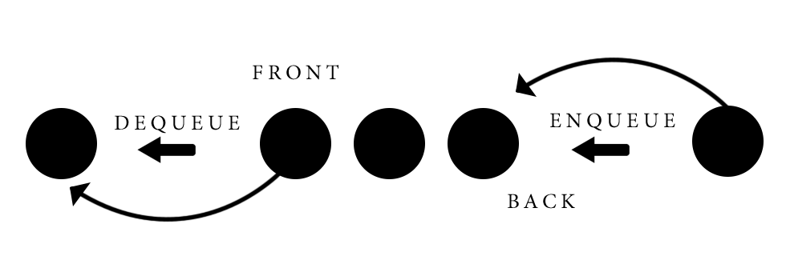

# Queues

## Introduction
---
A queue is a data structure that allows the programmer to insert, or append, elements at the back of a list and process them in order of insertion. This means that a queue follows the `"First In First Out"` principle when it comes to the runtime of the operations. A queue is a great data structure when things do need to be processed immediately, but can wait until the previous operations has completed. 
Here are the main characteristcs:

1. Follows the FIFO principles
2. Can be implemented in Python with a list
3. Easy to keep track of operations in consequential order

```python
# Adding elements to a list through the .append() method creates a queue
my_list = []
el_1 = 'car'
el_2 = 'airplane'
el_3 = 'bike'

my_list.append(el_1)
my_list.append(el_2)
my_list.append(el_2)

print(my_list)
# output -> ['car', 'airplane', 'bike']
```


## "First In First Out" Concept
---

Imagine a line at your favorite restaurant. How would you feel if the last customer that entered would be the first served? You may even wonder if you turn will ever come if customers will keep coming.
Queues follow the `"First In First Our"` concept just like a queue at a restaurant. The first element added, or `enqueued`, to the data structure is the first processed, or `dequeued`. It is not possible for an element to enter in the middle of a queue.




## Performance: Big O Notation
---
Queues are quite performant as there is just one way to `insert` and `delete` elements from it. The performance of the queue is based on the performance of the dynamic array if a python list is used.

|   Operation   |   Performance |
|   ---------   |   ----------- |
|   Enqueue     |   O(1)        |
|   Dequeue     |   O(n)        |

`Enqueuing` a new element has the performance of Big O of 1, because every element is inserted in the back, which takes only one step to complete. In contrast, `dequeuing` an element from the list takes n steps, because a list in Python is really a dyinamically allocated list, and it needs to go through all the elements to delete, or dequeue, the first one.


## Queues in Python
---
A list can be used to create a queue data structure. However, Python has a built-in library that can help creating a queue. We will see both methods to implementing a queue.

&nbsp;
### List
---
A queue can be easily implement in Python with a `list`. To dequeue an element, the programmer can use `[0]` or the `del` keyword:
```python
# Dequeue the first element with the pop() method
my_list = [34, 78, 983, 84]
my_list.pop[0]
print(my_list)
# Output -> [78, 983, 84]

# Dequeue the first element with the 'del' keyword
del my_list[0]
print(my_list)
# Output -> [983, 84]
```

To enqueue an element to the list, the best way is to use the built-in method `append()`, which will add the element as last in the list:

```python
# Enqueue an element to the list
my_list = [34, 78, 983, 84]
my_list.append(64)
print(my_list)
# Output -> [34, 78, 983, 84, 64]
```

To determine the size of a queue, the built-in `len()` method will return how many elements are in the array:

```python
# Find out the size, or length, of a list
my_list = [34, 78, 983, 84]
size = len(my_list)
print(size)
# Output -> 4
```

### Queue Library
---
It is possible to use a library to help us with queues functionalities called `queue`.
The `put()` method will insert an element at the back of the queue. The `get()` method will dequeue the element from the front of the queue.
The `qsize()` method will return the maxsize of the queue.
The `full()` or `empty()` methods will return a true of false boolean according if the queue is full or not.

Here is a code snippet to illustrate how it works:
```python
# Import the library
import queue

# Initialize a queue and provide the max length of the queue
my_queue = queue.Queue(maxsize=10)

# The 'qsize()' method returns the size of the queue
print(my_queue.qsize())
# Output -> 10

# Insert an element with the 'put()' method at the back of the queue
my_list.put(90)
my_list.put(9)
my_list.put(1)

# Check if the list is full or if you can add other elements
# The 'full()" returns a true or false according if the queue is full or not
print(my_list.full())
# Output -> False

# Dequeue the first element
my_list.get()

```
---
Which mathod is best? It is hard to tell. I would suggest try them both and see which one is easier to use. I would say that using a list would be easier for most beginners as it doesn't entail importing and using a different library.

&nbsp;
## Example: Printer
---
We are all familiar with using a printer at the local school, university, or work place. Usually, there is one printer for many employees. Frequently, many of these employees need to print documents and send the request to the printer around the same time. The printer can only process one document at a time. How can the printer process all these requests without crashing?

Here is the implementation of a simple Python program that leverages the power of queues to process all the requests in order. Imagine that this software handles all the "logistics" for the printer. Here are the implementation specifications:

- The Printer class needs to have a method to add a document to the queue
- The Printer must process the requests in order of insertion (FIFO)
- The Printer must print a sucess message after dequeuing an element from the list

Requirements
```python
# Initialize the Printer class
class Printer():
    """
    The Printer class allow users to enter a queue to print a document.
    It is implemented following the FIFO method to process the requests.
    """
    class Node():
        """
        Each Node in the queue will have a value (the document to print) assigned to it and the user who sent the document.
        """
        def __init__(self, document, user):
            self.value = document
            self.user = user
        
        def __str__(self):
            """
            Graphical representation of the node
            """
            return "Document: {} sent from {}".format(self.value, self.user)

    def __init__(self):
        """
        Initialize an empty queue
        """
        self.queue = []

    def enqueue_document(self, value, user):
        """
        Add a new Node at the back of the queue with a value and a user.attached. The Node will always be added at the back of the queue.
        """
        new_node = Printer.Node(value, user)
        self.queue.append(new_node)

    def dequeue_documents(self):
        """
        Dequeue all the elements, starting from the first. 
        Print all the documents until the queue is empty
        """
        # Check if the queue is empty
        if len(self.queue) == 0:
            print("There are no documents in the printer queue")
            return None

        while len(self.queue) != 0:
            item_to_print = self.queue.pop(0)
            print(f"\nPrinting item {item_to_print.value} from user {item_to_print.user}")
            print("Printing complete... Ready to print next item")

        if len(self.queue) == 0:
            print("\nPrinting complete. The queue is empty.")

    def __len__(self):
        """
        Support the len() function
        """
        return len(self.queue)

    def __str__(self):
        """
        Suppport the str() function to provide a string representation of the queue.
        """
        string = "["
        for node in self.queue:
            string += str(node)  # This uses the __str__ from the Node class
            string += ", "
        string += "]"
        return string

# Test cases
printer_queue = Printer() # Create the Printer object
printer_queue.enqueue_document('text1.txt', 'Anne') # Add a document to the queue
printer_queue.enqueue_document('text2.txt', 'Bob')  # Add a document to the queue
printer_queue.enqueue_document('text3.txt', 'Charlie')  # Add a document to the queue
print(printer_queue) # [Document: text1.txt sent from Anne, Document: text2.txt sent from Bob, Document: text3.txt sent from Charlie, ]
printer_queue.dequeue_documents() # Print all the documents in the queue
```

## Problem to Solve: Airport Departure Queue
---
 

*Image by [Dennis Gecaj](https://unsplash.com/photos/jVvtCCycgcQ?utm_source=unsplash&utm_medium=referral&utm_content=creditShareLink)*

Implement a Flight Departure system for the Fiftyville International Airport. Your task is to create a software that allows the user to enqueue new flights and be stored in the queue.
Flights will be dequeues according to departure time. Earliest flights must be dequeued first, later flights last. This is important as we don't want to have a late flight to depart too early!

### Requirements

- Flights that are enqueued should have a departure date and time greater than the current date and time.
- Flights must dequeued from the closest to the current time to the latest
- Flight codes must be unique. Make sure to check if the user is adding a flight code that is already in the queue.
- Implement a function to allow the user to reschedule a flight by providing the code, the new date, and time. Check that the user input a correct date - must be greater than the current date. 
- If two flights have the same date and time, the first one in the list should be dequeued first

&nbsp;

### Hints
---

- The `datetime` can be handy to compare dates and time of departure. Check out the [documentation](https://docs.python.org/3/library/datetime.html) for more information.
- Make sure to check the previous example to get started on the problem.
- The format of the date should be MM/DD/YY HH:MM. The datetime equivalent is `'%m/%d/%y %H:%M'`.

&nbsp; 

### Tests:
----
```python
# Test cases
airport = Airport_Departures()
airport.enqueue_flight('GTJH', '09/18/22 11:55')
airport.enqueue_flight('RTKJ', '07/09/22 22:55')
airport.enqueue_flight('ER34', '05/12/22 09:55')
airport.enqueue_flight('VFT9', '04/29/22 05:55')
airport.enqueue_flight('VFT9', '04/29/22 05:55') # Flight already in the queue
airport.enqueue_flight('V56Y', '02/20/19 01:55') # Invalid flight departure time
print(airport) # [Flight code GTJH. Departure time: 09/18/22 11:55, Flight code RTKJ. Departure time: 07/09/22 22:55, Flight code ER34. Departure time: 05/12/22 09:55, Flight code VFT9. Departure time: 04/29/22 05:55, ]
airport.dequeue_flight() # Flight code VFT9 has been successfuly dequeued and it is ready to depart on 04/29/22 05:55.
airport.dequeue_flight() # Flight code ER34 has been successfuly dequeued and it is ready to depart on 05/12/22 09:55.
print(airport) #[Flight code GTJH. Departure time: 09/18/22 11:55, Flight code RTKJ. Departure time: 07/09/22 22:55, ]
airport.reschedule('GTJH', '11/02/22 13:55') # Departure time of flight code GTJH has been updated
print(airport) # [Flight code GTJH. Departure time: 11/02/22 13:55, Flight code RTKJ. Departure time: 07/09/22 22:55, ]
```

&nbsp;

You can check your code with the solution here: [Solution](problem_queues_solution.py)

[Back to Welcome Page](0-welcome.md)