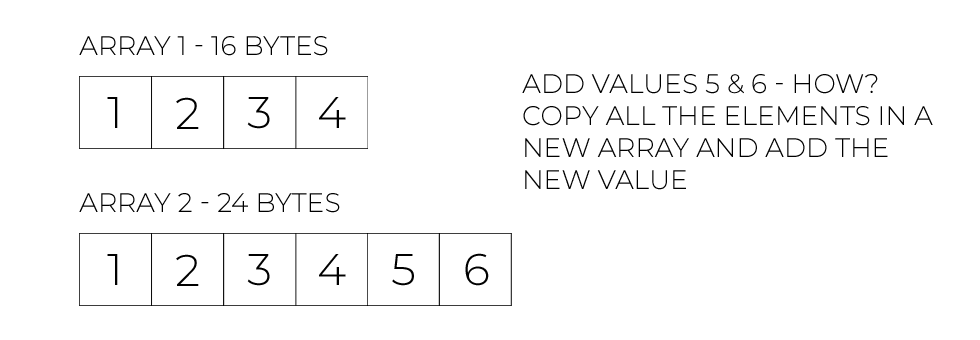
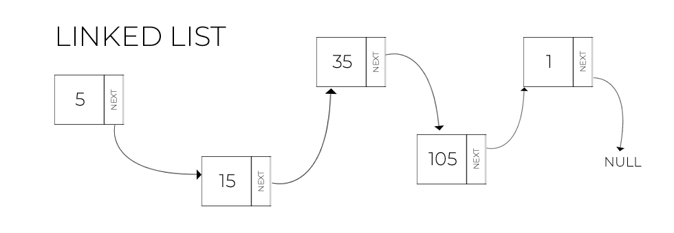
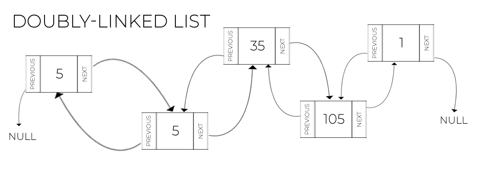

# Linked Lists

## Introduction
---
Arrays, or contiguous allocations of memory, are a useful structure to store data. The downside is that the programmer should know in advance how much memory to allocate for the list because it cannot be incremented once it has been established. How can we solve this situation?

The first workaround is to copy the entire array into a new, bigger array. This method allows the array to grow or shrink as much as we need. However, imagine when we have thousands, millions, or even billions of data, this can become very slow very quickly.



```c
// Low-level implementation of initializing an array in memory in C
// C is the language on which Python is built upon

int *array_1 = malloc(sizeof(int) * 4); // Alternatively: int array_2[4];
array_1[0] = 1;
array_1[1] = 2;
array_1[2] = 3;
array_1[3] = 4;

// If I want to add a fifth element, I would get a memory error as I touching memory that I have not initialized
// Solution: Create a new array of size 24 bytes to store all the six values

int *array_2 = malloc(sizeof(int) * 6);

// Copy all the values in the new array

for (int i = 0; i < 4; i++)
{
    array_2[i] = array_1[i];
}

// Add value 5 an 6
array_2[4] = 5;
array_2[5] = 6;

```

This implementation is the `C` programming language is just for discussion purposes. It is to show how the process becomes tedious and burdensome quickly for the computer. This is how the `append()` method works in Python. It creates a new array and copies over all the elements each time we 'append' a new element at the bottom. This is called a `Dynamic Array`. Stacks, Queues, and Maps are all `Dynamic Arrays`. 
```python
# Create a new list
array = list() # Alternatively: array = []

for i in range(4):
    array.append(i + 1) # [1, 2, 3, 4]

# Add elements 5 and 6
array.append(5)
array.append(6)

# [1, 2, 3, 4, 5, 6]

```

There is a more performant solution: a `Linked List`. The main advantage of a linked list is that values can be stored randomly in memory and do not have to be contiguous allocation of memory to function. Let's discuss the structure of a linked list to make this crucial feature possible.

## Linked List Structure
---
### Singly-Linked List

The picture below describes the structure of a `Linked List`.



Each value is connected to the next one by a pointer to the next location in memory. The structure containing the value and the pointer to the next value is called `Node`. A collection of nodes creates a `Linked List`. The first node is called `head`. If you know where the head is in memory, you can traverse the entire linked list following the pointers to the next value. The last node is called `tail` and it is recognizible because the pointer to `NULL`, or no value. 

Here is the structure of a linked list:
- Head Node - Beginning of the list
- n amount of Nodes - The lenght of the list
- Tail Node - The end of the list, points to no other Node.

### Doubly-Linked List
Most implementations of linked lists now a days allows the programmer to traverse the linked list bi-directionally. The picture below shows how this is implemented:



However, there is always a trade-off between time and memory space in Computer Science. The linked list structure is better and more dynamic for growing and shrinking arrays, but it comes with the cost of increased memory allocation. Along with the value, we now need to store the pointed to the next Node and the pointer to the value of the previous Node. What's the best solution? It depends on the length of the data to store and the space available. 


## Performance: Big O Notation
---
Let's compare the performance of a dynamic array and a linked list. The comparison is important to help us decide which structure to use. 

|   Operation    |  Dynamic Array    |  Linked List |
|   ------       |  ------------     |  ----------- |
|   Insert Head  |  O(n)             |  O(1)        |
|   Insert Middle|  O(n)             |  O(n)        |
|   Insert Tail  |  O(1)             |  O(1)        |
|   Remove Head  |  O(n)             |  O(1)        |
|   Remove Middle|  O(n)             |  O(n)        |
|   Remove Tail  |  O(1)             |  O(1)        |

As we can see, the dynamic array is fast for operations at the end of list whereas the Linked List is fast for operations at the beginning and end of the list. This is important to know as if we need to do operations at only at the end, such as a `queue` or a `stack`, we can implement a dyanmic array and save some storage space without hindering performance too much. 

Conversely, if we need to do operations both at the beginning and at the end, a Linked List may be the best solution for performance, granted that we have enough storage space for our application.

## Operations on Linked Lists
---

The two most important operations in a Linked List are:

- Inserting
- Removing

The challenge is that we do not want to lose any of our values as we add or remove any Node! If we are not careful, we may point our Node to the new value forgetting to link the rest of the list to the new Node. By the same token, we may remove a Node in the list without linking first the next value to the previous one. This mistakes can be very costly and break a program quickly. 

When we insert or delete a Node, there are three possible cases:

1. Insert/Delete at the Head
2. Insert/Delete in the Middle
3. Insert/Delete at the Tail

There is one special case, that is when the linked list is empty. In that case, the first value we add is the `head` and the `tail` at the same time. 
```python
if my_linked_list.head == None:
    my_linked_list.head = new_node
    my_linked_list.tail = new_node
```

### Insert at the Head
Here are the steps to insert at the Head of the linked list:

1. Create the new Node
2. Set the "next" pointer of the new Node to point to the current Head of the linked list
3. Set the "previous" pointer of the current head of the linked list to the new Node
4. Set the new Node as the new Head of the linked list

### Insert in the Middle
Here are the steps to insert in the Middle of the linked list, assuming that we want to insert our Node after `current`:

1. Create a new Node
2. Set the "next" pointer of the new Node to the "next" pointer of the current Node (so you will get the Node after current)
3. Set the "previous" pointer of the new Node to the current Node
4. Set the "previous" pointer of the Node after current to the new Node
5. Set the "next" pointer of the current Node to the new Node.

### Insert at the Tail
Here are the steps to insert at the Tail of the linked list:

1. Create a new Node
2. Set the "next" pointer of the new Node to `None`
3. Set the "previous" pointer of the new Node to the current tail of the linked list
4. Set the "next" pointer of the current Tail to the new Node
5. Set the new Node as the tail of the linked list

### Delete at the Head
Here are the steps to delete the first Node (Head) of the linked list:

1. Set the "previous" pointer of the second Node to `None`
2. Set the second Node as the new Head

### Delete in the Middle
Here are the steps to delete the current Node in a linked list:

1. Set the "previous" pointer of the Node after current to point to the Node before current
2. Set the "next" pointer of the Node before current to point to the Node after current

### Delete at the Tail
Here are the steps to delete the last Node (Tail) of the linked list:

1. Set the "next" pointer of the second to last Node to `None`
2. Set the second to last Node as the new Tail

## Linked Lists in Python
---
Python supports linked lists nativelly through the library `dequeue`. To use it, we need to import it at the top of the document and use the `dequeue()` method. For further instructions, please visit the online Python documentation regarding `dequeue`: [Dequeue Docs](https://docs.python.org/3/library/collections.html#collections.deque).
```python
import dequeue

my_linked_list = dequeue(1) # It instantialize an object that will allow the user to use all the features of a linked list

my_linked_list.append(2) # Append new element the right of the list
my_linked_list.appendleft(0) # Append new element the left of the list

print(my_linked_list) # [0, 1, 2]
```
This is the recommended way to implement a linked list in Python. Alternatively, the programmar can implement its own linked list class object as an exercise.

## Example: Reverse a Linked List
---
How does the `reverse()` method of `dequeue` work under the hood? Let's implement our version of `reverse()` so that, given a Linked List, when we call that method the reversed list is returned. If our initial list is `[0, 1, 2, 3, 4]` the returned list is `[4, 3, 2, 1, 0]`. We will implement this in Python using our own class.

Requirements
- Create a class to implement a linked list data structure
- The class should at least allow the user to add the head, tail, and an in the middle
- For the purpose of this example, we do not need to implement methods to remove and change Nodes
- The class must have a method to reverse a list without using the built-in function of the class
- The method should output a list containing all the values in reverse order

```python
"""
Example Problem Linked Lists
How to Reverse a List
"""

class LinkedList:
    """
    LinkedList class to implement the data structure. The purpose of this example is to show how to reverse a Linked List
    """
    class Node:
        """
        Create the structure for a Node
        """
        def __init__(self, data):
            """
            Initialized the Node to the data provided
            """
            self.data = data
            self.next = None
            self.prev = None
        
    def __init__(self):
        """
        Initiliaze an empty linked list
        """
        self.head = None
        self.tail = None
        self.reversed_list = list()
    
    def insert_head(self, value):
        """
        Insert a new Node as the head of the list
        """
        new_node = LinkedList.Node(value)

        # Case 1 - List is empty
        if self.head == None:
            self.head = new_node
            self.tail = new_node

        # Case 2 - List is not empty
        else:
            new_node.next = self.head
            self.head.prev = new_node
            self.head = new_node

    def insert_tail(self, value):
        """
        Insert a new Node at the tail of the list
        """
        new_node = LinkedList.Node(value)

        # Case 1 - List is empty
        if self.tail == None and self.head == None:
            self.head = new_node
            self.tail = new_node

        # Case 2 - List is not empty
        new_node.prev = self.tail
        self.tail.next = new_node
        self.tail = new_node

    def insert_after(self, value):
        """
        Insert new_value after the occurrence of value in the linked list
        """
        # Start searching at the head of the list
        current = self.head
        while current is not None:
            if current.data == value:
                # Check if the value is the tail
                # If so user the 'insert_tail() method'
                if current == self.tail:
                    self.insert_tail(value)
                # Insert the value in the middle of the list
                else:
                    new_node = LinkedList.Node(value)
                    new_node.prev = current
                    new_node.next = current.next
                    current.next.prev = new_node
                    current.next = new_node
                return
            # Check the next value in the list
            current = current.next
    
    def rev_list(self):
        """
        Return the reversed linked list
        """
        # Set the current Node to the tail
        current = self.tail
        
        # Iterate over the list from the tail to the head
        while current is not None:
            # Append the value to the list
            self.reversed_list.append(current.data)
            # Set current to the previous node
            current = current.prev

        # Return the list
        return self.reversed_list
    def __str__(self):
        """
        Returns a string representation of the object
        """
        output = "linkedlist["
        first = True
        for value in self:
            if first:
                first = False
            else:
                output += ", "
            output += str(value)
        output += "]"
        return output

    def __iter__(self):
        """
        Iterate forward through the Linked List
        """
        # Start at the beginning of the list
        current = self.head
        # Iterate over the entire link
        while current != None:
            # Provide or give each item to the user
            yield current.data
            # Go to the next Node
            current = current.next

# Test Cases
my_ll = LinkedList()
my_ll.insert_head(9) 
my_ll.insert_head(7) 
my_ll.insert_head(5) 
my_ll.insert_tail(3) 
my_ll.insert_tail(1) 
my_ll.insert_tail(0) 
print(my_ll) # linkedlist[5, 7, 9, 3, 1, 0]
print(my_ll.rev_list()) # [0, 1, 3, 9, 7, 5]

```

## Problem to Solve: Twitter
---
*
Photo by [Jeremy Bezanger](https://unsplash.com/@unarchive?utm_source=unsplash&utm_medium=referral&utm_content=creditCopyText) on [Unsplash](https://unsplash.com/s/photos/twitter?utm_source=unsplash&utm_medium=referral&utm_content=creditCopyText)*
  
Twitter is a social media platform that lets the user "tweet" (or send a brief message) to the world. You can also create a "Tweet Storm" (a Twitter thread) or comment on someone else's tweet. How do we keep track of the initial tweet and all its interactions?

Implement a class called `Twitter` that allows the user to create a `Tweet` (Hint: you probably want to create a class called `Tweet`) and allows you to "respond" to the tweet by adding a new tweet after that. The class should have a method that will allow the user to see the tweet and all its answers, in a text format, in the correct order

### Requirements
- The Tweet object requires a username to be initialized
- The Tweet object requires a text (no more than 280 char) to be initialized
- Make sure that the user can print the single Tweet and the Tweet Thread 
- Create a TwitterThread class to keep track of each tweet that are connected together
- For simplicity, we will allow the user to respond only to the main twitter thread

### Hints
- To make sure you can print an object in Python, the `__str__` method can be helpful

### Tests
---
```python
# Test Cases
twitter = Twitter()
new_thread = twitter.TwitterThread()
tweet_1 = new_thread.Tweet("Hello World", "federico")
print(tweet_1) # 'Hello World' created by federico
new_thread.new_thread(tweet_1, "federico")
print(new_thread) # twitter-thread['Hello World' created by federico]
twitter.add_new_thread(new_thread) # Thread added successfuly
twitter.print_thread() # twitter-thread['Hello World' created by federico]
tweet_2 = new_thread.Tweet("Hello to you", "luca")
new_thread.answer_tweet(tweet_2, "luca")
print(new_thread) # twitter-thread['Hello World' created by federico, 'Hello to you' created by luca]
```

You can check your code with the solution here: [Solution](problem_linked_lists_solution.py)

[Back to Welcome Page](0-welcome.md)