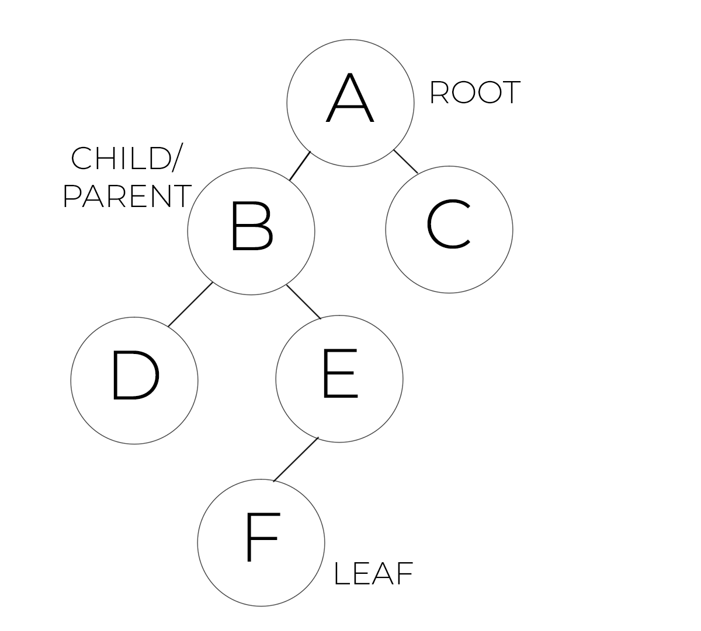
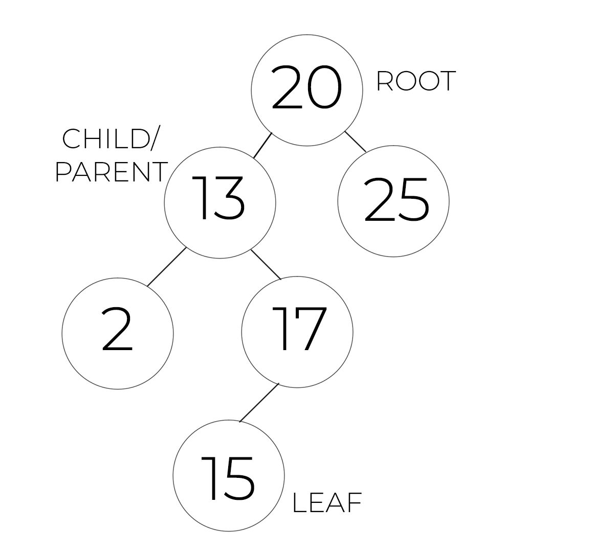

# Trees

## Introduction
---

Trees are data structures that allows the user to connect multiple nodes to a single one. Unlike linked lists, the node is usually connected to two other nodes. This features allows the trees to create more intricate and performant structures.

The main types of trees are `Binary Trees`, `Binary Search Trees`, and `Balanced Binary Searched Trees`. To understand the terminology that is associated with this data structure, here are some of the most common definitions:
* Root - The first, or parent, Node of the tree
* Parent Node - A Node that has one or more Nodes connected
* Child Node - A Node that has a Parent Node
* Leaf - A Node that has no children Nodes
* Subtree - A subset of a larger tree with a new root Node chosen appropriately

We will discuss some of the most common uses of Trees in programming.

## Types of Trees
---

There are three main types of trees:
1. Binary Tree
2. Binary Search Tree
3. Balanced Binary Search Tree

### Binary Tree
---
A `Binary Tree` is a Tree that no more than two Nodes for each Node. There is always a `root` Node that initiates the Tree. When a Node doesn't have any children nodes, it is called a `Leaf` and it is the end of that part of the Binary Tree. In between the `root` and the `leaf` nodes there are several parent-child relationship. There is no specific rule on how to input the data for this specific tree. Here is a graphical representation of the `Binary Tree`:



### Search Binary Tree
---
A `Search Binary Tree` is a special case of Binary Tree where the data must be input as follow:
* If the value is smaller than the `root` Node, then it is added to the left of the root node.
* If the value is greater than the the `root` Node, then it is added to the right of the root node.
* This process is replicated for each subsequent value to add considering subtrees of the main tree.

Here is a graphical representation of a possible `Search Binary Tree`:


A special vase of a `Search Binary Tree` is a Linked List. If all the nodes are put to the left or to the right of the root Node, then it is evident that the tree collapses into a Linked List.


### Balanced Search Binary Tree
---
A `Balanced Search Binary Tree` is a special case of a Search Binary tree where the tree is always 'balanced', meaning that the height of two different subtrees is not largely different. The height is a tree is the sum of all the nodes between the `root` and the `leaves` nodes.

Algorithms to balance a tree is outside the scope of this presentation. The most common are [Red Black Trees](https://www.geeksforgeeks.org/red-black-tree-set-1-introduction-2/) and [AVL](https://www.javatpoint.com/avl-tree) (click the link for more info).

## Performance: Big O Notation
---
The performance of a Balanced Search Binary Tree is `O(log n)` to search for a value.

The performance of a Search Binary Tree is `O(n)` to search for a value.

## Recursion
---
Recursion means that a function calls itself multiple times until it reaches a base case. It is an important concept for `Binary Trees` to understand how to do the most basic operations on them.

Recursion allows to solve some complex problem with relative ease. Recursive functions use more stack memories and this needs to be taken into account if memory can be an issue.

If you want to learn more, check out this link: [Recursion](https://www.geeksforgeeks.org/recursion/)

## Operations on Binary Search Trees
---

The two most common operations on Binary Trees are:
1. Inserting
2. Trasversing

**Inserting** into a Binary Tree is a recursive operation. The recursive question is whether the value should be insert to the left or to the right of the current node. Once there isn't a node, the recursion ends and the values is inserted in the correct position.

For this examples, we will not consider how to keep the Tree balanced as it would increase dramaticaly the complexity of the exercise.

```python
def insert(self, data):
	"""
	Insert 'data' into the BST.
    """
    # Check if the root exists
	if self.root is None:
        # If not, the node becomes the new root element
		self.root = BST.Node(data)
	else:
        # Otherwise, call the _insert() function
		self._insert(data, self.root)  # Start at the root

def _insert(self, data, node):
	"""
	This function will look for a place to insert a node
	with 'data' inside of it.  The current subtree is
	represented by 'node'.
	"""
    # If the data is smaller than the current node
	if data < node.data:
		# The data belongs on the left side.
        # Check if the node is empty
		if node.left is None:
			# The data becomes the new node
			node.left = BST.Node(data)
		else:
			# Need to keep looking.  Call _insert
			# recursively on the left subtree.
			self._insert(data, node.left)
	elif data >= node.data:
		# The data belongs on the right side.
        # Check if the node is empty
		if node.right is None:
			# The data becomes the new node
			node.right = BST.Node(data)
		else:
			# Need to keep looking.  Call _insert
			# recursively on the right subtree.
			self._insert(data, node.right)
```

If we would have to do the same operation without recursion, the complexity would increase greatly and the chance of bugs and errors increase as well. Recursion is an elegant and powerful way to insert an element in a Binary Tree.

**Trasverse** a Binary Tree means to go through each Node of the Tree and apply an action to it, most commonly to show the data. Due to the nature of a Balanced Search Binary Tree, the values will be shown from smallest to largest or viceversa.

The operation of traversing a Binary Tree is a recursive one. Traversing a Binary Tree is a complex operation to understand. If you want to learn more, please visit this link [Traversing a Binary Tree](https://www.geeksforgeeks.org/tree-traversals-inorder-preorder-and-postorder/).

## Binary Trees in Python
---
Python does not have a built-in library to deal with Binary Trees. If you want to use a third-party library, you can use `binarytree` ([link to dcumentation](https://binarytree.readthedocs.io/en/main/)). Here is a code snippet on how to use it. The first step is to run `pip install binarytree` so you have it available on your machine.

Then, here is an example:
```python
from binarytree import Node
root = Node(3)
root.left = Node(6)
root.right = Node(8)
 
# Getting binary tree
print('Binary tree :', root)
# output: Binary tree :
# 3
# / \ 
# 6 8
 
# Getting list of nodes
print('List of nodes :', list(root))
# output: List of nodes : [Node(3), Node(6), Node(8)]
 
# Getting inorder of nodes
print('Inorder of nodes :', root.inorder)
# output: Inorder of nodes : [Node(6), Node(3), Node(8)]
 
# Checking tree properties
print('Size of tree :', root.size)
# output: Size of tree : 3

print('Height of tree :', root.height)
# output: Height of tree : 1
 
# Get all properties at once
print('Properties of tree : \n', root.properties)
# output:
# Properties of tree : 
# {‘height’: 1, ‘size’: 3, ‘is_max_heap’: False, ‘is_min_heap’: True, ‘is_perfect’: True, ‘is_strict’: True, ‘is_complete’: True, ‘leaf_count’: 2, ‘min_node_value’: 3, ‘max_node_value’: 8, ‘min_leaf_depth’: 1, ‘max_leaf_depth’: 1, ‘is_bst’: False, ‘is_balanced’: True, ‘is_symmetric’: False}
```

As you can see, most things becomes much easy when we use third-party libraries. It is left to the person to create your own BinaryTree class implementing methods that allow the programmer to use  a Binary Tree similar to the binarytree library.

## Example: Reverse a Binary Tree
---
Given the `root` of a binary tree, invert the tree, and return its root. The purpose is to practice the concept of recursion and see how powerful it can be.

Example:
Input: root = [2,1,3] # 
Output: [2,3,1]	

Here is the Python code:
```python
 class BST():
# ..........#
	def invert_tree(self, root):
		"""
		Method that returns an inverted BST
		"""
		if root is None:
			return None

		root.left  = self.invert_tree(root.right)
		root.right = self.invert_tree(root.left)

		return root
# ..........#
```

The implementation of the rest of the class is left to the student as an additional exercise. This algorithm exepects a node to be passed as argument and recursively iterates over each node of the tree. What it does is to invert left with right. After all the calls in the stack have been executed, the BST will be successfuly reversed and kept balanced.

## Problem to Solve: Family Tree

---
You have been selected for a Software Engineering position at Family Search. The take home coding assignment is to create a simplified version of the data strcture that Family Search uses to manage its web application. You are tasked to create a Search Binary Tree in Python, as a class, and implement the following listed below.

Good luck!

### Requirements
1. Allow the user to input a new person - In this example, we won't take into consideration brothers or sisters, but only child-parents relations.
2. Allow the user to print the tree
3. Find a way to manage how to find a specific node
4. Each person must be identified by a name and a birthday
5. Allow the user to find the height of the tree to get how many generations have been implemented

### Tests
```python
# Test cases
family_tree = FamilyTree('Federico', '07/10/1992')
family_tree.insert('Luca', '02/05/1963')
family_tree.insert('Livia', '12/04/1963')
family_tree.insert('Carlo', '02/05/1963')
family_tree.insert('Rita', '12/04/1963')
family_tree.insert('Alessandra', '02/05/1963')
family_tree.insert('Luciano', '12/04/1963')

print(family_tree.get_generations())
for person in family_tree:
    print(person)
```

You can check your code with the solution here: [Solution](problem_trees_solution.py)

[Back to Welcome Page](0-welcome.md)